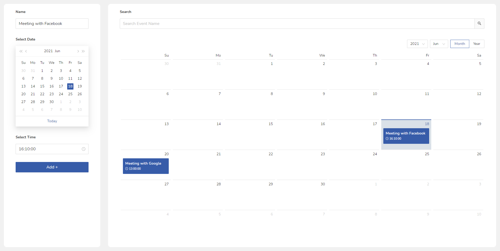

# Event Scheduler App

## โปรเจคนี้พัฒนาด้วย [Angular 11+](https://github.com/angular/angular-cli)

## [View Demo](https://panupat-top.github.io/Event-Schedule-App/dist/schedule-app/)

---

## ขั้นตอนใช้งาน

1. กำหนดชื่อ Event
2. เลือกวันที่
3. เลือกเวลา
4. กดปุ่ม `Add+` เพื่อเพิ่ม Event
5. Event ที่ถูกเพิ่ม จะปรากฎอยู่บน Calendar ตามวันและเวลาที่เราสร้าง
6. เราสามารถคลิ๊ก Event บน Calendar เพื่อดูข้อมูลแบบเต็มๆ ได้
7. เราสามารถค้นหา `ชื่อ` Event ได้ โดยระบบจะ filter เฉพาะรายการที่เราค้นหา

> \*\* ข้อมูลที่เราสร้างไม่ได้ถูกเก็บลงบน storage เมื่อมีการ reload ข้อมูลทั้งหมดจะหายไป

## Library Used

- [Ant Design](https://ng.ant.design)
- [Moment.js](https://momentjs.com/)
